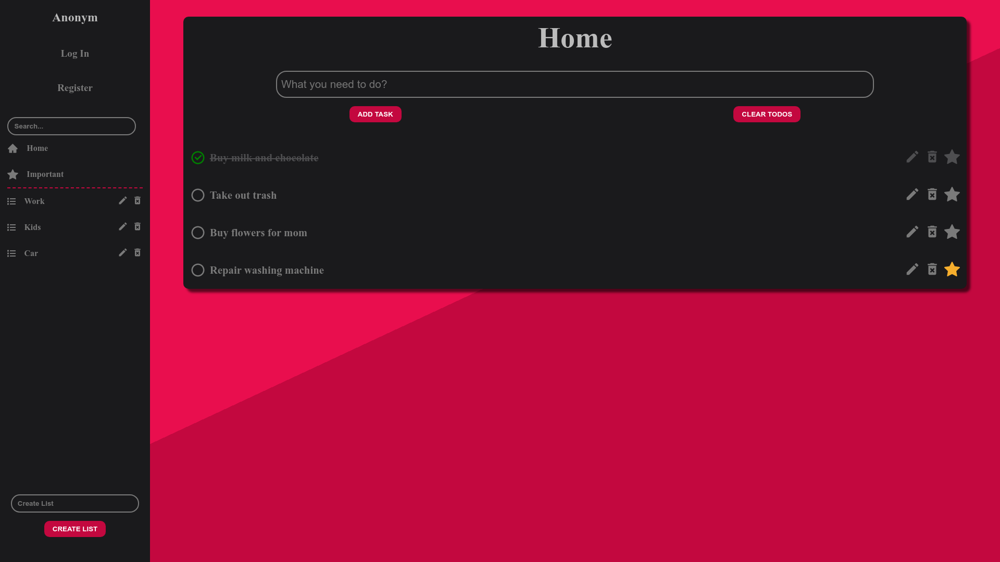

# TodoApp
Todo App developed in **React** and **Node.js**, that uses **MySql** relational database and **Sass**.

Basic functions like creating, deleting, renaming, adding and removing todos to important list are accessible without user. If you want to create todo lists you need to register and login.

http://todo-react-node.herokuapp.com/

# Used packages
I used these third party tools and packages for this project:

Client:
1) [react](https://reactjs.org/)
2) [react-dom](https://reactjs.org/docs/react-dom.html)
3) [react-icons](https://react-icons.github.io/react-icons/) (icon pack)
4) [react-router-dom](https://reactrouter.com/web/guides/quick-start) (routing)
5) [axios](https://github.com/axios/axios) (HTTP client)
6) [node-sass](https://www.npmjs.com/package/node-sass) (library for compiling .scss files to css)

Server:
1) [express](https://expressjs.com/) (NodeJS web application framework)
2) [express-session](https://www.npmjs.com/package/express-session) (session middleware for express)
3) [express-validator](https://express-validator.github.io/docs/) (set of express.js middlewares that wraps validator.js validator and sanitizer functions)
4) [dotenv](https://www.npmjs.com/package/dotenv) (zero-dependency module that loads environment variables)
5) [cors](https://www.npmjs.com/package/cors) (node.js package for providing a Connect/Express middleware that can be used to enable CORS with various options)
6) [cookie-parser](https://www.npmjs.com/package/cookie-parser) (parsing cookie headers)
7) [body-parser](https://www.npmjs.com/package/body-parser) (parses incoming request bodies in a middleware before your handlers)
8) [bcrypt](https://www.npmjs.com/package/bcrypt) (password hashing)
9) [mysql](https://www.npmjs.com/package/mysql) (NodeJS driver for MySQL)

# Getting Started

These instructions will get you a copy of the project up and running on your local machine for development and testing purposes.
## Installing

### 1) You need to install Node.js before start.
[Node.js](https://nodejs.org/en/)

Node also comes with npm package manager, that we will use to manage dependencies.

### 2) Clone this repository into your computer
    git clone https://github.com/MathiasHandle/TodoApp---hosting.git

### 3) Install dependencies
Run npm install from /client and /server directories in your project directory after you've cloned it.
    npm install
    
## ENV variables

###  1) Setup your own environment variables for database connection or create one with these credentials:

1) host: "localhost",
2) user: "admin",
3) password: "123456789",
4) database: "todo_app",

Database connection is located in /server/db.js

## Running
To run this app we need to open 2 terminals, one for client and one for server.

You will also need to run local MySql client, I suggest using [XAMPP](https://www.apachefriends.org/index.html).

### 1) cd into /client and /server directories from project directory.
    cd client
    cd server
    
### 2) start server
    node app.js
    
### 3) start client
    npm start

# Authors

    Mathias Handle

# License

Free for use and sharing.
